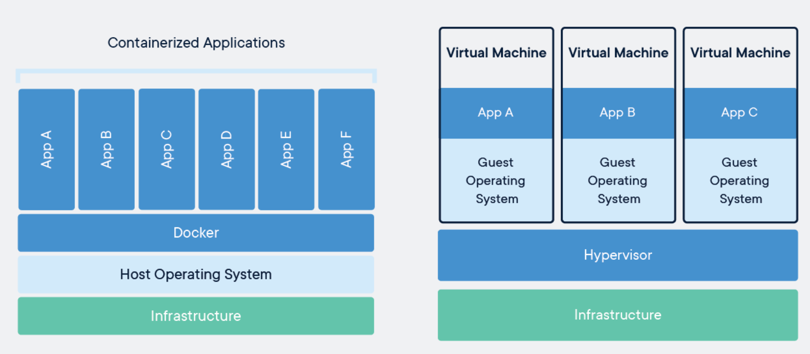

# 도커란

도커는 애플리케이션을 신속하게 구축, 테스트 및 배포할 수 있는 소프트웨어 플랫폼이다. 소프트웨어를 컨테이너라는 표준화된 유닛으로 패키징하며,
컨테이너는 라이브러리, 시스템 도구, 코드 등 소프트웨어 실행에 필요한 모든 것이 포함되어 있다. 즉, 도커는 컨테이너 환경에서 독릭적으로
애플리케이션을 수행할 수 있도록 컨테이너를 만들고 관리하는 것을 도와주는 도구이다.
 
도커를 통해 애플리케이션을 실행하면 독립적인 환경에서 일관된 결과를 보장한다. 도커의 핵심 개념은 이미지와 컨테이너이다.

## 컨테이너

컨테이너는 격리된 공간에서 프로세스가 동작하는 기술이다. 기존의 가상화 방식인 OS가상화가 아닌 프로세스를 격리하는 방식으로 동작한다.
리눅스에서 프로세스를 격리하는 방식을 리눅스 컨테이너라고 한다. 단순히 프로세스를 격리하기 때문에 가볍고 빠르다. 또한 CPU나 메모리는
프로세스가 필요한 만큼만 추가 사용하여서 성능적으로 거의 손실이 없다.

## 컨테이너와 가상머신(VM)의 차이

- **가상머신** : 공통적으로 하나의 서버가 있고 한 서버에는 어떤 운영체제가 있건 HostOS(리눅스, 윈도우즈 등)가 올라간다. VM의 경우 호스트OS에
  의해 VM을 가상화 시켜주는 HyperVisor(VMware, virture box 등)들이 있다. HyperVisor를 사용하여 원하는 운영체제로 GuestOS를 올려 여러
  VM을 만들 수 있다. GuestOS도 HostOS와 같이 하나의 OS를 독립적으로 가지고 있는 것처럼사용 가능하다.
- **컨테이너** : 하나의 HostOS 위에서 마치 각각의 독립적인 프로그램처럼 관리가 되고 실행된다. 불필요한 OS 만드는 작업 및 Infra를 독립적으로 
나눌 필요가 없어서 확장성이 좋고 빠르다.

### 컨테이너의 장점
- 애플리케이션 레벨 고립
- VM보다 빠른 셋업
- VM보다 메모리 덜 소모
- VM과 비교해 크기가 작아 마이그레이션, 백업, 전송이 쉬움
- 하드웨어와 빠른 커뮤니케이션에 따라 성능에 효과적일 수 있음
- 애플리케이션 전달 시간 감소
