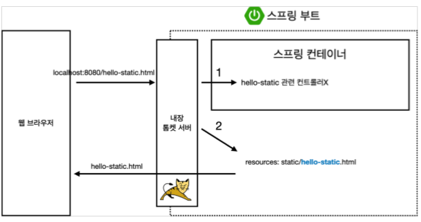
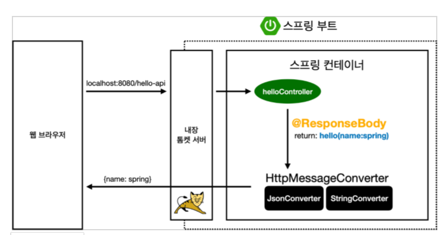

# 스프링 웹 개발 기초

1. 정적 컨텐츠
2. MVC와 템플릿 엔진
3. API

## 정적 컨텐츠

서버에서 작업하는 것 없이 파일을 그대로 웹 브라우저에 내려주는 것

## MVC와 템플릿 엔진

HTML을 그냥 주는 것이 아니라 서버에서 프로그래밍해서 HTML을 동적으로 바꿔서 내려주도록 하는 것

- MVC : Model, View, Controller
    - View : 화면 출력
    - Controller, Model : 비즈니스 로직, 내부처리

### MVC 대략적인 로직

1. 웹 브라우저에서 url로 요청하면 내장 톰켓서버가 요청을 받고 스프링에 넘긴다
2. 스프링은 컨트롤러 쪽에서 hello-static 이 있는지 찾는다.
3. 해당 컨트롤러가 존재하면 실행
4. 없다면 resources: static/hello-static.html 을 찾는다
5. 있다면 반환해준다.

### MVC 대략적인 로직 - RequestParam

1. 웹 브라우저에서 url로 요청하면 내장 톰켓서버가 요청을 받고 스프링에 넘긴다
2. 스프링이 해당 컨트롤러의 메서드를 호출한다.
3. 반환 값(`return : hello-template`,`model(name:spring)`)을 spring의 viewResolver 가 처리한다.
4. viewResolver는 화면을 찾아주고 관련된 템플릿 엔진을 연결시켜준다.
5. 템플릿 엔진이 랜더링을 해서 변환을 한 html을 웹 브라우저에 내려준다.

### API 로직 - @ResponseBody

HTTP 의 Body에 문자 내용을 직접 반환

1. 웹 브라우저에서 url로 요청하면 내장 톰켓서버가 요청을 받고 스프링에 넘긴다.
2. 스프링에 해당 컨트롤러가 있는지 찾아 호출한다
3. @ResponseBody 가 있다면 spring의 HttpMessageConverter 가 처리한다.
4. 값이 문자열이면 StringHttpMessageConverter, 객체이면 MappingJackson2HttpMessageConverter 가 동작한다.
5. 처리한 값을 반환한다.

`참고 : 클라이언트의 HTTP Accept 헤더와 서버의 컨트롤러 반환 타입 정보 둘을 조합해서 HttpMessageConverter 가 선택
된다. `