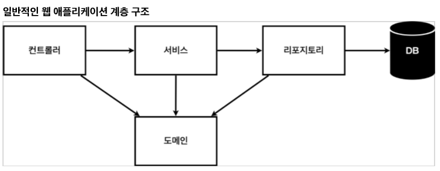

# 회원 관리 예제 - 백엔드 개발
- 비즈니스 요구사항 정리
- 회원 도메인과 리포지토리 만들기
- 회원 리포지토리 테스트 케이스 작성
- 회원 서비스 개발
- 회원 서비스 테스트

## 비즈니스 요구사항 정리

- 데이터 : 회원 ID, 이름
- 기능 : 회원 등록, 조회
- 가상의 시나리오 : 아직 데이터 저장소(DB)가 선정되지 않음

*일반적인 웹 애플리케이션 계층 구조*

- 컨트롤러 : 웹 MVC 의 컨트롤러 역할
- 서비스 : 핵심 비즈니스 로직 구현
- 리포지토리 : 데이터베이스에 접근, 도메인 객체를 DB에 저장하고 관리
- 도메인 : 비즈니스 도메인 객체, 예) 회원, 주문, 쿠폰 등 주로 데이터베이스에 저장하고 관리됨

*클래스 의존관계*

- 아직 DB가 선정되지 않아서, 우선 인터페이스로 구현 클래스를 변경할 수 있도록 설계
- DB가 없이 개발을 진행하기 위해 초기 개발 단계에서는 구현체로 가벼운 메모리 기반의 DB 사용

